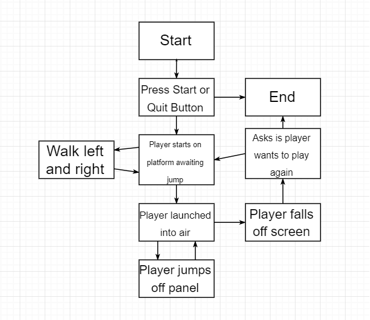

# 5.0 Software Requirements Specification

## 5.1 Introduction
Panel Jumper is a two-dimensional infinite jumper game.
Think about the game doodle jump and the concept of this game will be a bit easier to understand.
However, unlike doodle jump, the player does not jump off of platforms but rather off of vertical platforms.
Essentially the character will be wall jumping in order to gain higher ground rather
than jumping from horizontal platforms. This game is meant to invoke wall jumping game mechanics
that can be seen in Super Mario like games, into an infinite jumper like game.

### UML Game Activity Diagram

## 5.2 Functional Requirements
### 5.2.1 **Menus**
- 5.2.1.1 Panel Jumper shall provide a main menu for users/players to navigate options of the application.
 - Panel Jumper's main menu will allow users/players to click a button that will transition into the actual game.
 - Panel Jumper's main menu will allow players to click a button that will quit the game application.
 - Panel Jumper's main menu will allow players to click a button that will bring up an options menu.
- 5.2.1.2 Panel Jumper shall provide an options menu for users/players to customize their game experience.
 - Panel Jumper's options menu will allow players to choose one out of three default difficulty levels (easy, medium, hard).
 - Panel Jumper's options menu will allow players to choose the color of their character.
 - Panel Jumper's options menu should allow players to choose the color of their game background.
 - Panel Jumper's options menu will allow players to turn on/off game music.
 - Panel Jumper's options menu will allow players to turn on/off game sound effects.
 - Panel Jumper's options menu will allow players to reset their local high score.
 - Panel Jumper's options menu will allow players to return to the main menu.
- 5.2.1.3 Panel Jumper shall provide a game over menu after players die during actual gameplay.
 - Panel Jumper's game over menu will be displayed only after the player has failed by falling below the screen.
 - Panel Jumper's game over menu will display the player's current score upon failure.
 - Panel Jumper's game over menu will display the player's highest achieved score upon failure.
 - Panel Jumper's game over menu will display the top ten players on the server.
 - Panel Jumper's game over menu will allow players to click a restart button that will replay the game.
 - Panel Jumper's game over menu will allow players to click a button that will quit the game application.
 - Panel Jumper's game over menu will allow players to click a button that will bring them to the main menu.
 - Panel Jumper's game over menu will allow players to click a button that will bring up an options menu.
### 5.2.2 **Game**
- 5.2.2.1 Panel Jumper shall provide a fun, yet challenging 2D infinite jumper game experience.
 - Panel Jumper's game mode will allow players to move left and right.
 - Panel Jumper's game mode will allow players to jump.
 - While in the air, players will only be able to jump if they are jumping off a panel.
 - While in the air, players will be able to move their character left and right.
 - Different types of panels will appear in the game adding variety to gameplay.
 - As the player continues to jump higher, their score will increase.
 - As the player continues to jump higher, the game will become more difficult by providing less panels.
 - As the player continues to jump higher, the game will become more difficult by providing more difficult types of panels.
 - The game over menu will appear if the player falls bellow the screen.
- 5.2.2.2 Panel Jumper's game mode shall provide a user interface providing relevant information while remaining minimal.
 - Panel Jumper's game UI will show the player's current score in the upper left corner of the screen.
 - Panel Jumper's game UI will show the player's highest score in the upper right corner of the screen.

## 5.3 Performance Requirements
### 5.3.1 **Menus**
- 5.3.1.1 Panel Jumper shall transition from main menu to game mode in no longer than 3 seconds.
- 5.3.1.2 Panel Jumper shall transition from main menu to the options menu in no longer than 1 second.
- 5.3.1.3 Panel Jumper shall save any changes made to the game from the options menu in no longer than 1 second.
- 5.3.1.4 Panel Jumper shall transition from game mode to the game over menu instantly upon player's failure.
- 5.3.1.5 Panel Jumper shall transition from game over menu to the main menu in no longer than 1 second.
- 5.3.1.6 Panel Jumper shall transition from game over menu to a restarted game mode in no longer than 1 second.
- 5.3.1.7 Panel Jumper shall transition from game over menu to the options menu in no longer than 1 second.
- 5.3.1.8 Panel Jumper shall transition from options menu to main menu in no longer than 1 second.
### 5.3.2 **Game**
- 5.3.2.1 Panel Jumper shall provide a smooth game experience in that all actions are immediately recognized and there is no delay in user inputs.
- 5.3.2.2 Panel Jumper shall immediately generate new panels as the player gets higher so there is a seamless sense of continuous gameplay.

## 5.4 Environment Requirements
### 5.4.1	Development Environment Requirements
Hardware Requirements

| Category | Requirement |
|---|---|
| Processor | Intel Core i7  |
| Graphics Card | Intel(R) HD Graphics 520 |
| Ram | 8 GB
| Display | 2x3, 256 colors (game is ran in 2x3 format)
| Sound Card | Optional

Software Requirements

| Category | Requirement |
|---|---|
| Operating System | Windows and iOS (MacOS and Android) |
| Compiler | Microsoft Visual C# |
| Game Engine | Unity

These development requirements can be assumed to be the requirements for running the game. The game is primarily being developed on a Windows 10 machine and iOS device, but should still function properly on MacOS and Android.
